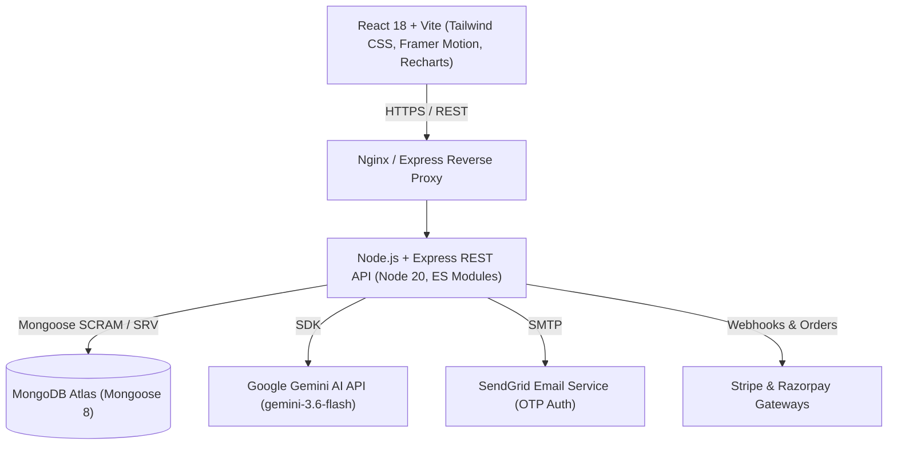

# 🛍️ ShopHub — Full-Stack E-Commerce & AI Platform

[](https://github.com/grvd5678/ecommerce-backend/actions)
[](https://github.com/grvd5678/ecommerce-frontend/actions)
[](https://nodejs.org/)
[](https://opensource.org/licenses/ISC)

A production-ready, full-stack MERN e-commerce platform engineered with a high-performance **React 18 (Vite)** frontend, a secure **Node.js/Express** REST API backend, and **MongoDB Atlas**. Features executive **Recharts visual analytics**, integrated **Google Gemini AI** (conversational assistant & SEO copy generator), dual payment gateways (**Stripe & Razorpay**), automated **GitHub Actions CI/CD**, and **Docker** containerization.

---

## 🌐 Live Deployments

| Service | Platform | Live URL |
|---|---|---|
| **Frontend Web App** | Render (Static Site) | [https://ecommerce-frontend-l3zz.onrender.com](https://ecommerce-frontend-l3zz.onrender.com) |
| **Backend REST API** | Render (Web Service) | [https://ecommerce-api-tio6.onrender.com](https://ecommerce-api-tio6.onrender.com) |
| **API Health Check** | Render | [https://ecommerce-api-tio6.onrender.com/health](https://ecommerce-api-tio6.onrender.com/health) |

---

## 📑 Table of Contents

- [Architectural Overview](#-architectural-overview)
- [Key Features](#-key-features)
- [Tech Stack](#-tech-stack)
- [Project Structure](#-project-structure)
- [Quick Start (Local Development)](#-quick-start-local-development)
- [Docker Setup (1-Command)](#-docker-setup-1-command)
- [Environment Variables](#-environment-variables)
- [API Reference](#-api-reference)
- [Testing & CI/CD](#-testing--cicd)
- [Security & Production Hardening](#-security--production-hardening)

---

## 🏗️ Architectural Overview



---

## ✨ Key Features

### 🛍️ Customer Shopping Experience
- **Authentication & Security:** JWT stateless authentication, bcrypt password hashing, and SendGrid OTP email verification for signup and password reset.
- **Product Discovery:** Instant search with debounce, multi-criteria filtering (category, price range, ratings), sorting, and related product recommendations.
- **Dynamic Shopping Cart:** Persistent user cart, animated quantity steppers, item exit animations, and promotional coupon engine (`SAVE10`, `SAVE20`, `FLAT50`).
- **Payment Processing:** Integrated dual gateways supporting **Stripe** and **Razorpay** with backend signature verification.
- **Order Lifecycle:** Self-service order history, live visual order tracker (`OrderTracker`), and order cancellation workflows.
- **Engagement & Social Proof:** Star ratings, customer review submission, helpful vote counters, and back-in-stock email notifications (`NotifyMe`).

### 📊 Business Intelligence & Admin Suite
- **Visual Analytics Dashboard:** Powered by **Recharts**:
  - **KPI Metrics:** Total gross revenue, order volume, catalog size, active users, and Average Order Value (AOV).
  - **Revenue & Orders Area Chart:** Gradient timeline tracking daily gross sales.
  - **Fulfillment Donut Chart:** Status breakdown (`Delivered`, `Processing`, `Pending`, `Shipped`, `Cancelled`).
  - **Top 5 Best-Sellers Bar Chart:** Units sold and gross revenue per item.
  - **Category Breakdown:** Inventory distribution grouped by department.
  - **Time Range Filter:** 7 Days, 30 Days, 90 Days, and All-Time data aggregation.
- **Catalog Management:** Full CRUD operations for products with category tagging and stock limits.
- **User & Order Management:** Role-based access control (Admin/Customer), order status updates, and user role promotion.

### 🤖 Generative AI Layer (Google Gemini)
- **AI Shopping Assistant:** Conversational chatbot widget on the storefront answering customer queries regarding product features, pricing, and shipping.
- **AI Product Description Generator:** One-click *"✨ Generate with AI"* button in the Admin Product Editor that generates high-converting, SEO-optimized marketing copy from a product title using `gemini-3.6-flash`.

---

## 🛠️ Tech Stack

### Frontend
- **Core:** React 18, Vite 7, React Router DOM v6
- **Styling:** Tailwind CSS, Lucide React icons
- **Data Visualization:** Recharts 2.x
- **Animations:** Framer Motion (Page transitions, cart drawer, micro-interactions)
- **State & Networking:** Context API + useReducer, Axios (with auth interceptors)
- **Notifications:** React Toastify

### Backend
- **Core:** Node.js 20 (ES Modules), Express.js
- **Database:** MongoDB Atlas, Mongoose 8
- **AI & Cloud Services:** `@google/generative-ai` (Gemini), `@sendgrid/mail`
- **Security:** Helmet, CORS, Express Rate Limit, CSRF protection
- **Testing:** Jest, Supertest, MongoDB Memory Server

### DevOps & Infrastructure
- **Containerization:** Docker, Docker Compose, Multi-stage Nginx builds
- **CI/CD:** GitHub Actions (Automated build verification & Jest test suites)
- **Hosting:** Render (Cloud Native Web Service & Static Site)

---

## 📂 Project Structure

```
ecommerce/
├── docker-compose.yml              # Multi-service local container orchestration
├── ecommerce-backend/
│   ├── .github/workflows/ci.yml    # Backend GitHub Actions CI pipeline
│   ├── config/                     # Database and environment configurations
│   ├── controllers/                # Business logic handlers
│   ├── middleware/                 # Auth (JWT), Validation (Joi), CSRF
│   ├── models/                     # Mongoose schemas (8 collections)
│   ├── routes/                     # REST API route definitions
│   ├── tests/                      # Jest & Supertest integration suites
│   ├── utils/                      # Email and logger helpers
│   ├── Dockerfile                  # Node 20 Alpine container
│   ├── server.js                   # Application entry point
│   ├── seed.js                     # 11-product database seeder
│   └── package.json
└── ecommerce-frontend/
    ├── .github/workflows/ci.yml    # Frontend GitHub Actions CI pipeline
    ├── src/
    │   ├── components/             # Reusable UI components & modals
    │   ├── context/                # Auth, Cart, Wishlist, Theme contexts
    │   ├── pages/                  # Route views (Home, AdminDashboard, etc.)
    │   └── utils/                  # Axios instance & reducers
    ├── Dockerfile                  # Multi-stage Vite + Nginx container
    ├── nginx.conf                  # Production SPA routing configuration
    └── package.json
```

---

## 🚀 Quick Start (Local Development)

### Prerequisites
- Node.js >= 20.0.0
- npm >= 10.0.0
- MongoDB Atlas account or local MongoDB instance

### 1. Clone the repository
```bash
git clone https://github.com/grvd5678/ecommerce-backend.git
git clone https://github.com/grvd5678/ecommerce-frontend.git
```

### 2. Backend Setup
```bash
cd ecommerce-backend
npm install
cp .env.example .env    # Configure MONGODB_URI and JWT_SECRET
node seed.js            # Seed initial catalog items
npm run dev             # Starts API on http://localhost:5000
```

### 3. Frontend Setup
```bash
cd ../ecommerce-frontend
npm install
npm run dev             # Starts SPA on http://localhost:5173
```

---

## 🐳 Docker Setup (1-Command)

Spin up the entire stack (MongoDB 7, Backend API, and Frontend SPA) in isolated containers:

```bash
docker compose up --build
```

- **Frontend:** `http://localhost:3000`
- **Backend API:** `http://localhost:5000/api`
- **MongoDB:** `localhost:27017`

---

## ⚙️ Environment Variables

### Backend (`ecommerce-backend/.env`)
```env
PORT=5000
NODE_ENV=development
MONGODB_URI=mongodb+srv://<user>:<password>@cluster0.spxsqdl.mongodb.net/ecommerce?retryWrites=true&w=majority
JWT_SECRET=your_jwt_secret_key_here

# SendGrid Email
EMAIL_HOST=smtp.sendgrid.net
EMAIL_PORT=465
EMAIL_FROM=your_verified_email@domain.com
EMAIL_USER=apikey
EMAIL_PASS=your_sendgrid_api_key

# Payment Gateways
STRIPE_SECRET_KEY=sk_test_...
STRIPE_PUBLISHABLE_KEY=pk_test_...
RAZORPAY_KEY_ID=rzp_test_...
RAZORPAY_KEY_SECRET=your_razorpay_secret

# Google Gemini AI
GEMINI_API_KEY=your_gemini_api_key
```

### Frontend (`ecommerce-frontend/.env`)
```env
VITE_API_URL=http://localhost:5000/api
```

---

## 📡 API Reference

| Method | Endpoint | Description | Auth |
|---|---|---|---|
| `GET` | `/health` | Server health check | Public |
| `POST` | `/api/auth/register` | User signup + send OTP email | Public |
| `POST` | `/api/auth/verify-otp` | Verify email OTP | Public |
| `POST` | `/api/auth/login` | Login and receive JWT | Public |
| `GET` | `/api/products` | Paginated product list with search & filters | Public |
| `POST` | `/api/products/generate-description` | **Gemini AI** product copy generator | Admin |
| `GET` | `/api/admin/analytics` | **Recharts** aggregated business intelligence | Admin |
| `GET` | `/api/cart` | Retrieve user cart | User |
| `POST` | `/api/orders` | Place order | User |
| `POST` | `/api/payment/create-order` | Create payment transaction | User |
| `POST` | `/api/chat` | **Gemini AI** conversational support assistant | Public |

---

## 🧪 Testing & CI/CD

Run backend automated Jest integration tests:
```bash
cd ecommerce-backend
npm test
```

Continuous Integration is automated via **GitHub Actions**:
- **Backend Workflow:** Installs dependencies and runs Jest integration tests against an in-memory database.
- **Frontend Workflow:** Installs dependencies and verifies production Vite builds (`npm run build`).

---

## 🔒 Security & Production Hardening

- **Stateless Authentication:** Secure JWTs with expiration and bearer authorization.
- **Input Validation:** Strict Joi schema validation for all mutating payloads.
- **HTTP Hardening:** Helmet-configured security headers (HSTS, CSP, X-Frame-Options).
- **Rate Limiting:** `express-rate-limit` prevents brute-force login and API flooding.
- **DNS Resilience:** Integrated DNS server fallbacks to ensure robust SRV resolution on cloud hosting providers.

---

## 📄 License

This project is licensed under the [ISC License](LICENSE).
